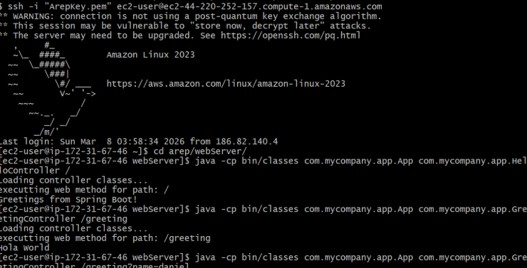

# AREP – Servidor Web con Framework IoC por Reflexión

Mini framework web implementado en **Java 17** que permite construir aplicaciones a partir de POJOs anotados, al estilo de Spring Boot. Usa **anotaciones personalizadas** (`@RestController`, `@GetMapping`, `@RequestParam`) y la **API de reflexión de Java** para descubrir controladores, registrar rutas y resolver argumentos en tiempo de ejecución.

El proyecto se desarrolló para la asignatura **Arquitecturas Empresariales (AREP)** y se desplegó en **AWS EC2**.

---

## Tabla de contenido

1. [Características](#características)
2. [Arquitectura y diseño](#arquitectura-y-diseño)
3. [Estructura del proyecto](#estructura-del-proyecto)
4. [Requisitos](#requisitos)
5. [Instalación y compilación](#instalación-y-compilación)
6. [Uso](#uso)
7. [Crear un nuevo controlador](#crear-un-nuevo-controlador)
8. [Pruebas](#pruebas)
9. [Despliegue en AWS](#despliegue-en-aws)
10. [Tecnologías](#tecnologías)
11. [Autor](#autor)

---

## Características

- **Descubrimiento de controladores** mediante la anotación `@RestController`.
- **Enrutamiento declarativo**: cada método anotado con `@GetMapping("/ruta")` se registra automáticamente como un endpoint.
- **Enlace de parámetros**: los valores del *query string* se inyectan en los argumentos del método mediante `@RequestParam`, con soporte para valores por defecto.
- **Carga dinámica**: la clase del controlador se recibe como argumento y se carga en tiempo de ejecución con `Class.forName(...)`.
- **Sin dependencias de frameworks externos**: todo el mecanismo de IoC está implementado con la librería estándar de Java.

---

## Arquitectura y diseño

### Anotaciones

| Anotación | Destino | Retención | Propósito |
|-----------|---------|-----------|-----------|
| `@RestController` | Clase (`TYPE`) | `RUNTIME` | Marca una clase como componente web que expone endpoints. |
| `@GetMapping(value)` | Método (`METHOD`) | `RUNTIME` | Asocia una ruta HTTP GET con un método del controlador. |
| `@RequestParam(value, defaultValue)` | Parámetro (`PARAMETER`) | `RUNTIME` | Vincula un parámetro del *query string* con un argumento del método. |

Todas las anotaciones usan `RetentionPolicy.RUNTIME` para que estén disponibles vía reflexión durante la ejecución.

### Flujo de procesamiento de una petición

```
 ┌──────────────┐    1. Class.forName()     ┌──────────────────────┐
 │  App (main)  │ ────────────────────────▶ │  Clase controladora  │
 └──────┬───────┘                           │  @RestController     │
        │ 2. getDeclaredMethods()           └──────────────────────┘
        │    + isAnnotationPresent(@GetMapping)
        ▼
 ┌────────────────────────────┐
 │  Tabla de rutas            │   "/pi"    → HelloController#pi()
 │  Map<String, Method>       │   "/hello" → HelloController#hello(...)
 └──────┬─────────────────────┘
        │ 3. Parseo de la URL:  /hello?name=Juan
        │    ruta = "/hello"   query = {name=Juan}
        ▼
 ┌────────────────────────────┐
 │  Resolución de argumentos  │   @RequestParam("name") → "Juan"
 │  (o defaultValue)          │
 └──────┬─────────────────────┘
        │ 4. method.invoke(instancia, args)
        ▼
 ┌────────────────────────────┐
 │  Respuesta (String)        │
 └────────────────────────────┘
```

1. **Carga**: `App` recibe el nombre completamente calificado del controlador y lo carga con `Class.forName`, verificando que tenga `@RestController`.
2. **Registro**: recorre los métodos declarados y almacena en una tabla (`Map<String, Method>`) aquellos anotados con `@GetMapping`, usando la ruta como llave.
3. **Parseo**: separa la URI en *path* y *query string*, y convierte este último en un mapa clave–valor.
4. **Invocación**: para cada parámetro del método busca su `@RequestParam`, toma el valor del query (o el `defaultValue` si no viene) e invoca el método con `Method.invoke`.

---

## Estructura del proyecto

```
AREP-Servidor-Web/
├── despliegue.png              # Evidencia del despliegue en AWS
├── src/
│   ├── main/java/com/mycompany/app/
│   │   ├── App.java                # Punto de entrada: carga, registro e invocación
│   │   ├── HelloController.java    # Controlador de ejemplo
│   │   ├── RestController.java     # Anotación de clase
│   │   ├── GetMapping.java         # Anotación de método
│   │   └── RequestParam.java       # Anotación de parámetro
│   └── test/java/com/mycompany/app/
│       └── AppRoutingTest.java     # Pruebas de enrutamiento y parámetros
├── pom.xml
└── README.md
```

---

## Requisitos

| Herramienta | Versión mínima |
|-------------|----------------|
| Java (JDK)  | 17             |
| Maven       | 3.9            |
| Git         | 2.x            |

Verificar las versiones instaladas:

```bash
java -version
mvn -version
```

---

## Instalación y compilación

```bash
# 1. Clonar el repositorio
git clone https://github.com/<usuario>/AREP-Servidor-Web.git
cd AREP-Servidor-Web

# 2. Compilar
mvn clean compile
```

Las clases compiladas quedan en `target/classes`.

---

## Uso

La aplicación recibe dos argumentos:

```bash
java -cp target/classes com.mycompany.app.App <ClaseControlador> <URI>
```

| Argumento | Descripción | Ejemplo |
|-----------|-------------|---------|
| `<ClaseControlador>` | Nombre completamente calificado de la clase anotada con `@RestController`. | `com.mycompany.app.HelloController` |
| `<URI>` | Ruta a invocar, opcionalmente con *query string*. | `/pi`, `/hello?name=Juan` |

### Ejemplos

Endpoint `/pi`:

```bash
java -cp target/classes com.mycompany.app.App com.mycompany.app.HelloController /pi
```

Endpoint `/hello`:

```bash
java -cp target/classes com.mycompany.app.App com.mycompany.app.HelloController /hello
```

> **Nota:** si la URI incluye parámetros (`?` o `&`), enciérrela entre comillas para que la shell no los interprete:
> `java -cp target/classes com.mycompany.app.App com.mycompany.app.HelloController "/hello?name=Juan"`

---

## Crear un nuevo controlador

Cualquier POJO puede exponerse como servicio web añadiendo las anotaciones:

```java
package com.mycompany.app;

@RestController
public class GreetingController {

    @GetMapping("/greeting")
    public String greeting(@RequestParam(value = "name", defaultValue = "World") String name) {
        return "Hola " + name;
    }
}
```

Compilar y ejecutar:

```bash
mvn clean compile
java -cp target/classes com.mycompany.app.App com.mycompany.app.GreetingController "/greeting?name=Juan"
# Salida esperada: Hola Juan
```

---

## Pruebas

Las pruebas unitarias (JUnit) validan:

- El registro de rutas a partir de métodos anotados con `@GetMapping`.
- La invocación correcta de endpoints estáticos.
- El enlace de parámetros con `@RequestParam`, incluyendo el uso de `defaultValue` cuando el parámetro no está presente.

Ejecutar:

```bash
mvn test
```

### Resultados

Reporte generado en `target/surefire-reports/com.mycompany.app.AppRoutingTest.txt`:

```text
-------------------------------------------------------------------------------
Test set: com.mycompany.app.AppRoutingTest
-------------------------------------------------------------------------------
Tests run: 3, Failures: 0, Errors: 0, Skipped: 0
```

---

## Despliegue en AWS

La aplicación se desplegó en una instancia **Amazon EC2** (Amazon Linux). Pasos generales:

```bash
# 1. Copiar el proyecto a la instancia
scp -i <llave>.pem -r AREP-Servidor-Web ec2-user@<IP-publica>:~

# 2. Conectarse por SSH
ssh -i <llave>.pem ec2-user@<IP-publica>

# 3. Instalar Java 17 y Maven
sudo yum install -y java-17-amazon-corretto-devel maven

# 4. Compilar y ejecutar
cd AREP-Servidor-Web
mvn clean compile
java -cp target/classes com.mycompany.app.App com.mycompany.app.HelloController /pi
```

### Evidencia



---

## Tecnologías

- **Java 17** – lenguaje y API de reflexión (`java.lang.reflect`).
- **Maven** – gestión de construcción y dependencias.
- **JUnit** – pruebas unitarias.
- **AWS EC2** – infraestructura de despliegue.

---

## Autor

**Juan Esteban Lozano** – Escuela Colombiana de Ingeniería Julio Garavito
